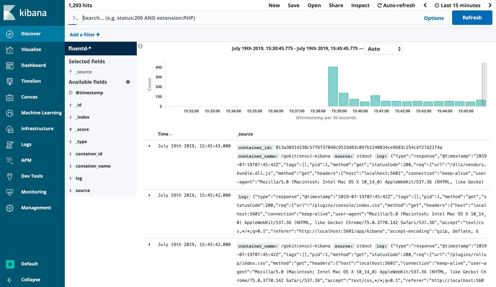

<h1 align="center">Welcome to gokitconsul 👋</h1>
<p>
  <a href="https://github.com/cage1016/gokitconsul/blob/master/LICENSE">
    
  </a>
  <a href="https://twitter.com/CageChung">
    
  </a>
</p>

> go kit microservice demo with consul & zipkin

## Dependency

- consul as discover service
- prometheus monitor service
- grafana analytics service
- zipkin as trace service
- fluentd
- kibana
- elasticsearch
- gateway
    - http → grpc (8000)
    - grpc proxy (8001)

## Services

- pkg/addsvc
- pkg/foosvc

## Install

```sh
# build docker image form bindary
make rebuilds

# clear build (options)
make dockers
```

## Usage

```sh
# start
$ make u
docker-compose -f deployments/docker/docker-compose.yaml up -d
Creating network "net" with driver "bridge"
Recreating gokitconsul-elasticsearch ... done
Creating gokitconsul-fluentd         ... done
Recreating gokitconsul-grafana       ... done
Recreating gokitconsul-consul        ... done
Recreating gokitconsul-prometheus    ... done
Recreating gokitconsul-zipkin        ... done
Creating gokitconsul-kibana          ... done
Creating gokitconsul-addsvc          ... done
Creating gokitconsul-gateway         ... done
Creating gokitconsul-foosvc          ... done


$ docker ps
CONTAINER ID        IMAGE                                 COMMAND                  CREATED             STATUS              PORTS                                                                                                            NAMES
7da33c5f4ae8        cage1016/gokitconsul-gateway:latest   "/exe"                   4 seconds ago       Up 3 seconds        0.0.0.0:8000-8001->8000-8001/tcp                                                                                 gokitconsul-gateway
c5521d8d8879        cage1016/gokitconsul-foosvc:latest    "/exe"                   4 seconds ago       Up 3 seconds                                                                                                                         gokitconsul-foosvc
3804cea4fa33        cage1016/gokitconsul-addsvc:latest    "/exe"                   6 seconds ago       Up 4 seconds                                                                                                                         gokitconsul-addsvc
0225bdb521a2        grafana/grafana                       "/run.sh"                8 seconds ago       Up 6 seconds        0.0.0.0:3000->3000/tcp                                                                                           gokitconsul-grafana
17d3253f5e98        openzipkin/zipkin                     "/busybox/sh run.sh"     8 seconds ago       Up 7 seconds        9410/tcp, 0.0.0.0:9411->9411/tcp                                                                                 gokitconsul-zipkin
f157f98e2651        prom/prometheus                       "/bin/prometheus --c…"   8 seconds ago       Up 6 seconds        0.0.0.0:9090->9090/tcp                                                                                           gokitconsul-prometheus
240b055c29bb        consul:1.5.1                          "docker-entrypoint.s…"   8 seconds ago       Up 6 seconds        0.0.0.0:8400->8400/tcp, 8301-8302/udp, 0.0.0.0:8500->8500/tcp, 8300-8302/tcp, 8600/udp, 0.0.0.0:8600->8600/tcp   gokitconsul-consul
013a30314238        kibana:6.6.1                          "/usr/local/bin/kiba…"   8 seconds ago       Up 7 seconds        0.0.0.0:5601->5601/tcp                                                                                           gokitconsul-kibana
d67f9970fef9        docker_fluentd                        "tini -- /bin/entryp…"   9 seconds ago       Up 8 seconds        5140/tcp, 0.0.0.0:24224->24224/tcp, 0.0.0.0:24224->24224/udp                                                     gokitconsul-fluentd
9590182d4175        elasticsearch:6.6.1                   "/usr/local/bin/dock…"   10 seconds ago      Up 9 seconds        0.0.0.0:9200->9200/tcp, 9300/tcp                                                                                 gokitconsul-elasticsearch
```

## Test

```sh
# sum
$ curl -X "POST" "https://localhost:8000/addsvc/sum" -H 'Content-Type: application/json; charset=utf-8' -d $'{ "a": 133, "b": 10333}'
{"rs":10466,"err":null}

# concat
$ curl -X "POST" "https://localhost:8000/addsvc/concat" -H 'Content-Type: application/json; charset=utf-8' -d $'{ "a": "133", "b": "10333"}'
{"rs":"13310333","err":null}

# foo
$ curl -X "POST" "https://localhost:8000/foosvc/foo" -H 'Content-Type: application/json; charset=utf-8' -d $'{ "s": "😆"}'
{"res":"foo 😆","err":null}

$ curl -X "POST" "https://localhost:8000/foosvc/foo" -H 'Content-Type: application/json; charset=utf-8' -d $'{ "s": "hello gokit 😆"}'
{"error":"result exceeds maximum size"}

# addcli through grpc proxy
$ go run cmd/addcli/main.go -grpc-addr localhost:8001 -method sum 1 22
1 + 22 = 23

$ go run cmd/addcli/main.go -grpc-addr localhost:8001 -method concat 1 22
"1" + "22" = "122"

# foocli throuth grpc proxy
$ go run cmd/foocli/main.go -grpc-addr localhost:8001 world
Foo world = foo world
```

## Consul & zipkin

_consult_
visit http://localhost:8500


_zipkin_
visit http://localhost:9411


_prometheus_
visit http://localhost:9000


_grafana_
visit http://localhost:3000 (admin/password)


_kibana_
visit http://localhost:5601


## Stop

```sh
# docker-compose down
$ make d
```

## Author

👤 **KAI-CHU CHUNG**

* Twitter: [@CageChung](https://twitter.com/CageChung)
* Github: [@cage1016](https://github.com/cage1016)

## 🤝 Contributing

Contributions, issues and feature requests are welcome!<br />Feel free to check [issues page](https://github.com/cage1016/gokitconsul/issues).

## Show your support

Give a ⭐️ if this project helped you!

## 📝 License

Copyright © 2019 [KAI-CHU CHUNG](https://github.com/cage1016).<br />
This project is [MIT](https://github.com/cage1016/gokitconsul/blob/master/LICENSE) licensed.

***
_This README was generated with ❤️ by [readme-md-generator](https://github.com/kefranabg/readme-md-generator)_